# Catalog Project
This project has been developed following the [Zen of Python - PEP20](http://www.python.org/dev/peps/pep-0020/) 'development philosophy'.   
The code has been refactored to keep it [DRY - Don't Repeat Yourself](http://wiki.c2.com/?DontRepeatYourself).
## Description   
Provides a list of items within a variety of categories as well as provide a user registration and authentication system. Registered users will have the ability to post, edit and delete their own items.
This is a dynamic website with persistent data storage to create a web application that provides ac compelling service to th users.   

Run `pip install -r requirements.txt` to install the project requirement into the development environment.    
 
## Languages, Frameworks & Style Sheets 

| Item                      | Description  | Version |
|:---                       |:---          |:---     |
| Frameworks                | Bootstrap    | 4.3     |
| Languages                 | Python 3     | 3.7.3   |
| Protocols                 | HTTP, TCP    |         |
| Markup Language           | HTML         | 5       |
| Object Relational Mapper  | SQLAlchemy   | 1.3.3   |
| Stylesheets Languages     | CSS          | 3       |
| Version Control           | Git, GitHub  | 2.16.1  |
| Web Application Framework | Flask        | 1.0.2   |   

## Packages & Versions   

| Package          | Version |
|:---              |:---     |
| Bootstrap 4      | 4.3     |
| Click            | 7.0     |
| Flask            | 1.0.3   |
| Flask-Login      | 0.4.1   |
| flask_httpauth   | 3.2.4   |
| flask-SQLAlchemy | 2.4.0   |
| flask-WTF        | 0.14.2  |
| httplib2         | 0.12.3  |
| itsdangerous     | 1.1.0   |
| Jinja2           | 2.10.1  |
| JQuery           | 3.4.0   |
| MarkupSafe       | 1.1.1   |
| oauth2client     | 4.1.3   |
| passlib          | 1.7.1   |
| python-dotenv    | 0.10.2  |
| requests         | 2.22.0  |
| Werkzeug         | 0.15.4  |

## DB Structure   

| Table         |Description                               |
|:---           |:---                                      |
| Auth          | Auth - Login/Logout date-time stamp      |
| Catalog       | Contains links between Category and Item |
| Category      | Category data table                      |
| Item          | Item data table                          |
| User          | User data table                          |

### `auth` Table   
| Name        | Details                     | Description                       |
|:---         |:---                         |:---                               |
| id          | int AUTO_INCREMENT unsigned | Unique `auth` identifier          |
| user_id     | int                         | `user_id` of current user session |
| login_time  | datetime                    | `user` login datetime             |
| logout_time | datetime                    | `user` logout datetime            |

### `catalog` Table   
| Name        | Details                     | Description |
|:---         |:---                         |:--- |
| id          | int AUTO_INCREMENT unsigned | Unique `catalog` identifier        |
| category_id | int                         | `category_id` to identify Category |
| item_id     | int                         | `item_id` to identify Item         |
| last_update | datetime                    | last update operation `datetime`   |

### `category` Table   

| Name        | Details                     | Description                             |
|:---         |:---                         |:---                                     |
| id          | int AUTO_INCREMENT unsigned | Unique `category` identifier            |
| name        | varchar(250)                | `category` name                         |
| description | varchar(250)                | `category` description                  |
| last_update | datetime                    | `category` last_update datetime         |
| owner       | int                         | `user_id` that has created the category |

### `item` Table   

| Name        | Details                     | Description                         |
|:---         |:---                         |:---                                 |
| id          | int AUTO_INCREMENT unsigned | Unique `item` identifier            |
| name        | varchar(250)                | `item` name                         |
| description | varchar(250)                | `item` description                  |
| price       | varchar(15)                 | `item` price                        |
| last_update | datetime                    | `category` last_update datetime     |
| owner       | int                         | `user_id` that has created the item |

### `user` Table   

| Name          | Details                     | Description                                     |
|:---           |:---                         |:---                                             |
| id            | int AUTO_INCREMENT unsigned | Unique `user` identifier                        |
| email         | varchar(50)                 | `user` email                                    |
| password      | varchar(100)                | `user` hashed password                          |
| username      | varchar(50)                 | `user` name                                     |
| active        | bool                        | validate if current user is active              |
| first_name    | varchar(50)                 | `user` first name                               |
| last_name     | varchar(50)                 | `user` last name                                | 
| picture       | varchar(100)                | `user` picture path                             |
| authenticated | bool                        | validate if current user has been authenticated |
| last_login    | datetime                    | `user` datetime of last_login                   |
| provider      | varchar(10)                 | `local`, `facebook` or `google`                 |
| profile       | varchar(10)                 | `profile`, `user` or `admin`                    |
| session_token | varchar(150)                | `user` session token, created per session       |

This is the Database Structure, and its relationships:   

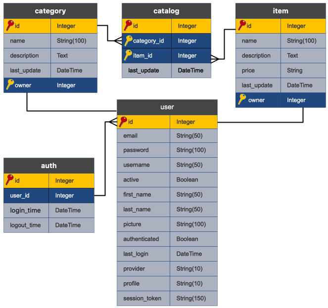   

## Routes / Paths
For this project the server is `localhost`, and the port is `5000`.  Then, for all the following routes/paths  add 
`http://localhost:5000` to the beginning.  Example: `http:localhost:5000/<path>`   

### Public   
#### Public Routes/Paths - Root    
The `homepage` displays all current categories along with the latest added items   
  
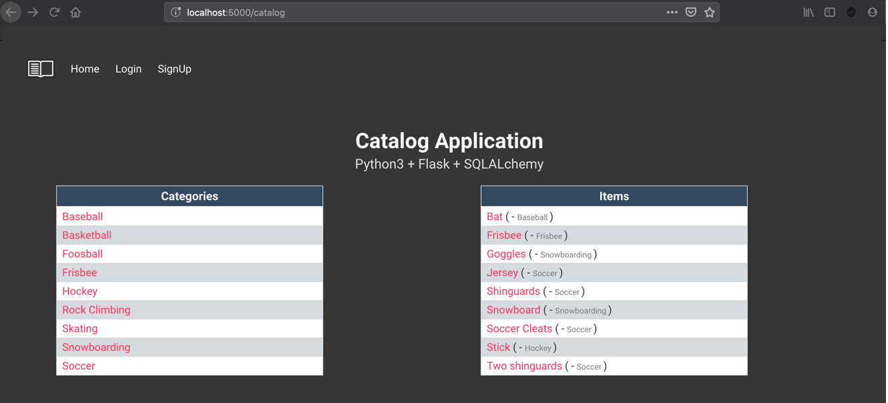   

| Path     | Description                                |
|:---      |:---                                        |
| /        | Shows a list of **Categories** & **Items** |
| /catalog |                                            |   

#### Public Routes/Paths - Category   
Selecting a specific `Category` shows all information and the items available for that `Category`.
   
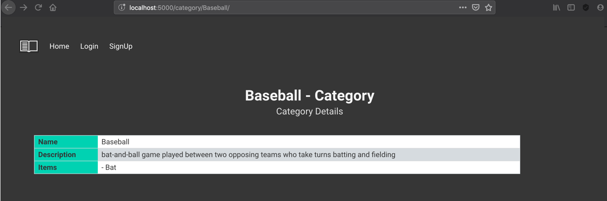      
   
| Path                            | Description                                         |
|:---                             |:---                                                 |
| /catalog/<category_id>/         | Show  `Category` details and a list of **items** in |
| /catalog</category_id>/category |     linked with current `Category`                  |   

#### Public Routes/Paths - Item   
Selecting a specific `Item` shows specific information of that `Item` and the Categories linked with that `Item`.

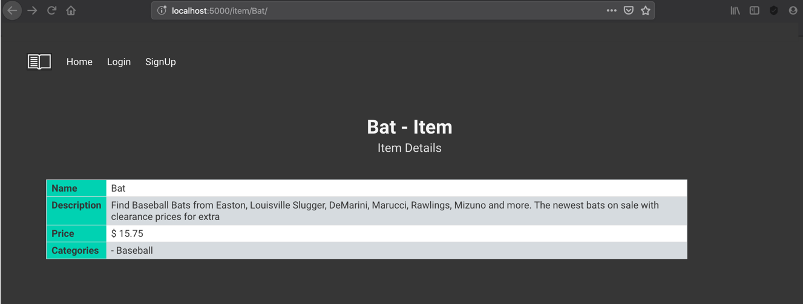      
| Path                             | Description                       |
|:---                              |:---                               |
| /catalog/category/<item_id>/     | Shows data of a selected **item** |
| /catalog/category/<item_id>/item |                                   |

#### Public Routes/Paths - SignUp
The user should `signup` to obtain a user and has access to application CRUD functionalities.
The `signup` can be `local user` or `Facebook` or `Google` accounts signup.      
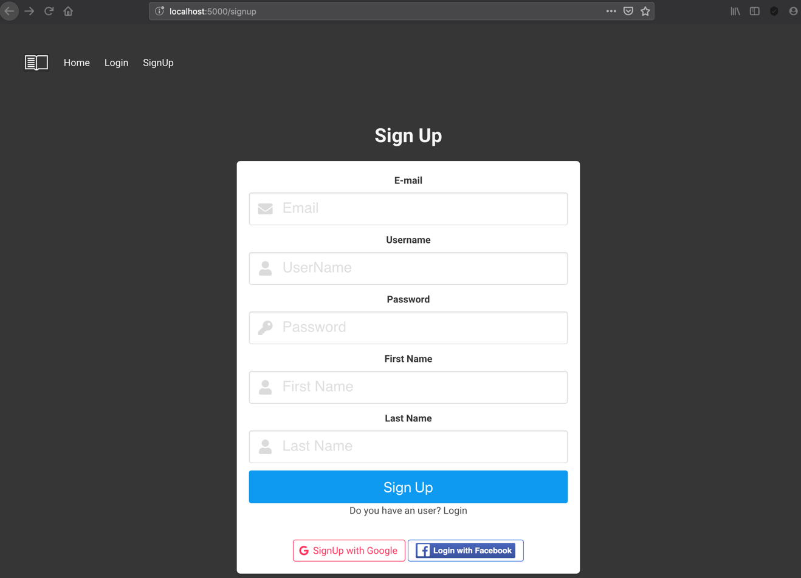

| Path     | Description                                                       |
|:---      |:---                                                               |
| /signup  | The user has the option to create an account, with a `local user` |
|          |     account or with `Facebbook` or `Google` accounts              |

#### Public Routes/Paths - LogIn   
The user has the option for `Login`.
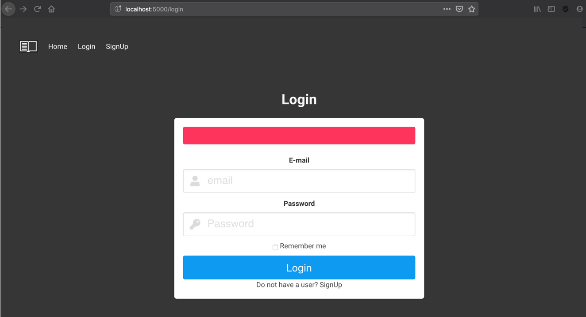

| Path   | Description                                                      |
|:---    |:---                                                              |
| /login | The user has the option to `login` into the application, with an |
|        |     account that exist in the application                        |

### Private   
#### Private Routes/Paths - Root
After logging in, a user has the ability to add, update, or delete a `Category` or an `Item`.
In main page, the user has the option to create a `new Category` or a `new Item`.

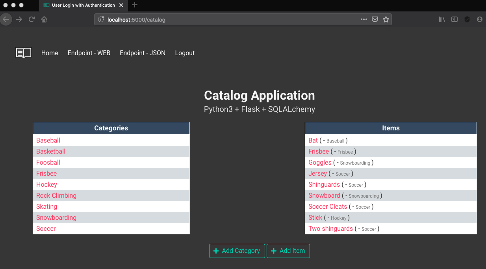

| Path     | Description                                                 |
|:---      |:---                                                         |
| /        | Shows a list of **Categories** & **Items** after user login |
| /catalog |    with `update` & `delete` options                         |   

#### Private Routes/Paths - Create Category
After logging in, a user has the ability to add a `Category`.
In main page, the user has the option to create a `new Category` and associate/link `items`.

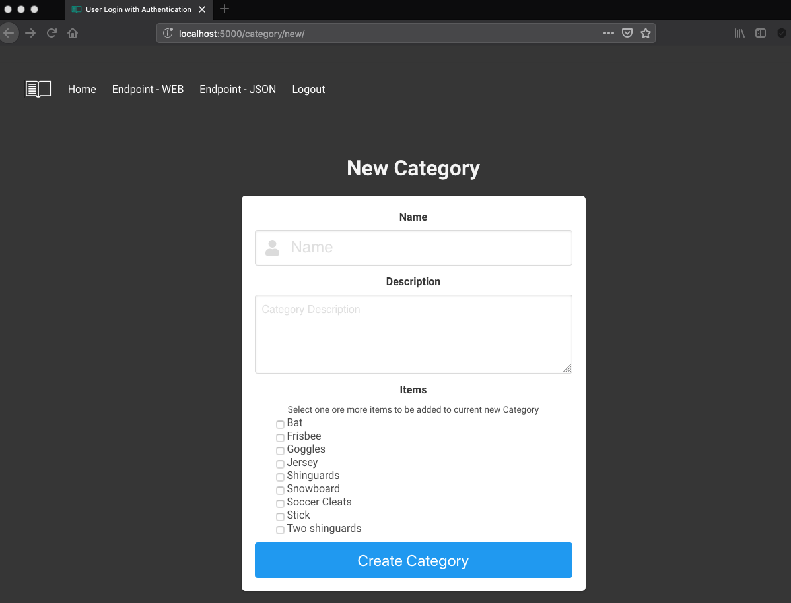

| Path          | Description                                                         |
|:---           |:---                                                                 |
| /             | Shows a form with required information to create the new `Category` |
| /category/new |    and a list of `Items` that can be associated/linked              |   

#### Private Routes/Paths - Select Category   
The logged-in user has the option to select a `Category` and on this page he has the option to `update` or `delete` the selected `Category`, if he is the `owner`.   

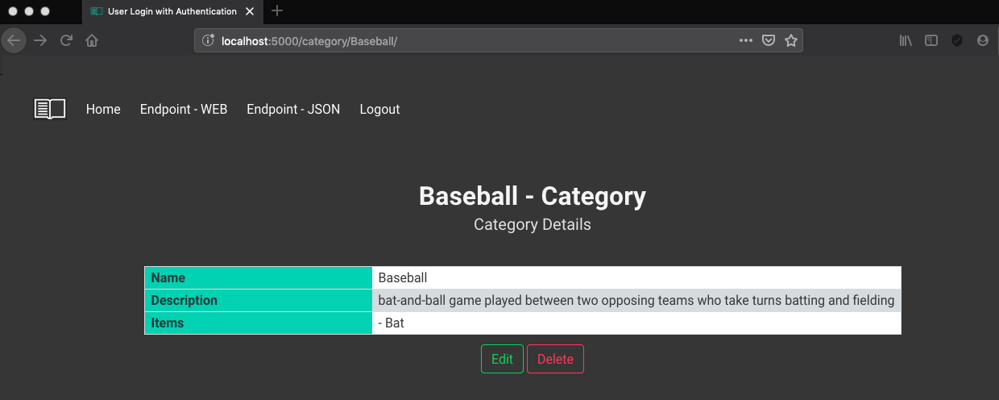

| Path                       | Description                                                                  |
|:---                        |:---                                                                          |
| /category/<category_name>/ | Shows the `Category` information and a list of all associated/linked `Items` |

#### Private Routes/Paths - Edit Category   
The logged-in user has the option to `edit` a `Category` and on this page he has the option to `update` one or more fields, and `add` or `delete` associated/linked `items`, if he is the `owner`.   

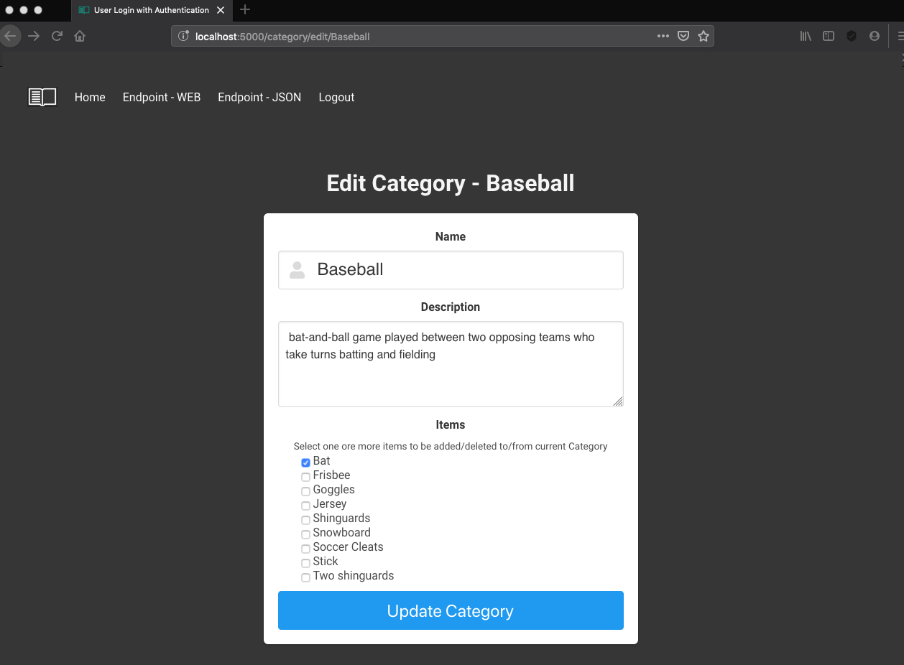

| Path                            | Description                                                                                  |
|:---                             |:---                                                                                          |
| /category/edit/<category_name>/ | Shows the `Category` information and a list of all associated/linked `Items` to be `updated` |

#### Private Routes/Paths - Delete Category   
The logged-in user has the option to `delete` a `Category`, and a validation message appears, if he is the `owner`.   

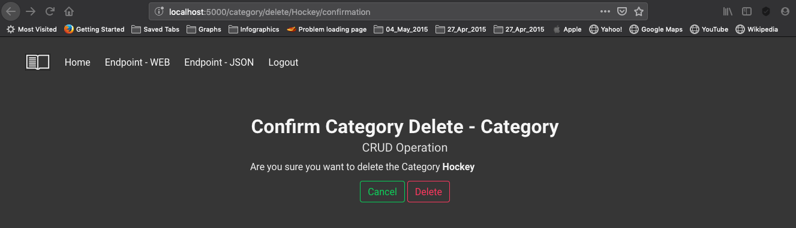

| Path                              | Description                                                               |
|:---                               |:---                                                                       |
| /category/delete/<category_name>/ | Shows a message to validate the `delete` operation on selected `Category` |

#### Private Routes/Paths - Create Item
After logging in, a user has the ability to add an `Item`.
In main page, the user has the option to create a `new Item` and associate/link `categories.

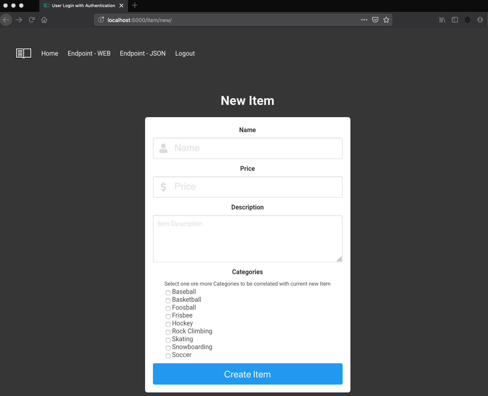

| Path      | Description                                                     |
|:---       |:---                                                             |
| /         | Shows a form with required information to create the new `Item` |
| /item/new |    and a list of `categories` that can be associated/linked     |   

#### Private Routes/Paths - Select Item   
The logged-in user has the option to select an `Item` and on this page he has the option to `update` or `delete` the selected `Item`, if he is the `owner`.   

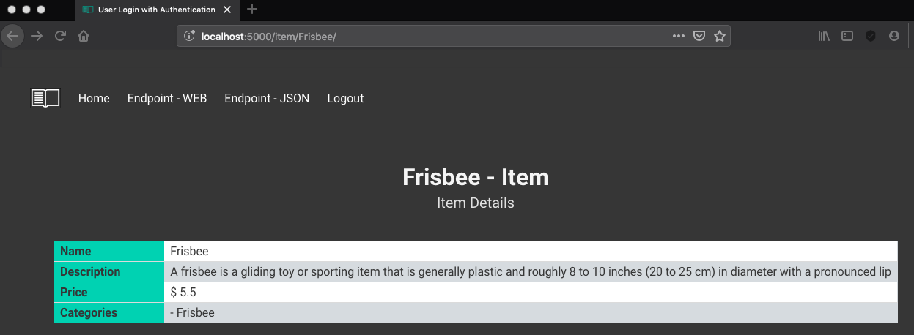

| Path               | Description                                                                   |
|:---                |:---                                                                           |
| /item/<item_name>/ | Shows the `Item` information and a list of all associated/linked `Categories` |

#### Private Routes/Paths - Edit Item   
The logged-in user has the option to `edit` an `Item` and on this page he has the option to `update` one or more fields, and `add` or `delete` associated/linked `categories`, if he is the `owner`.   

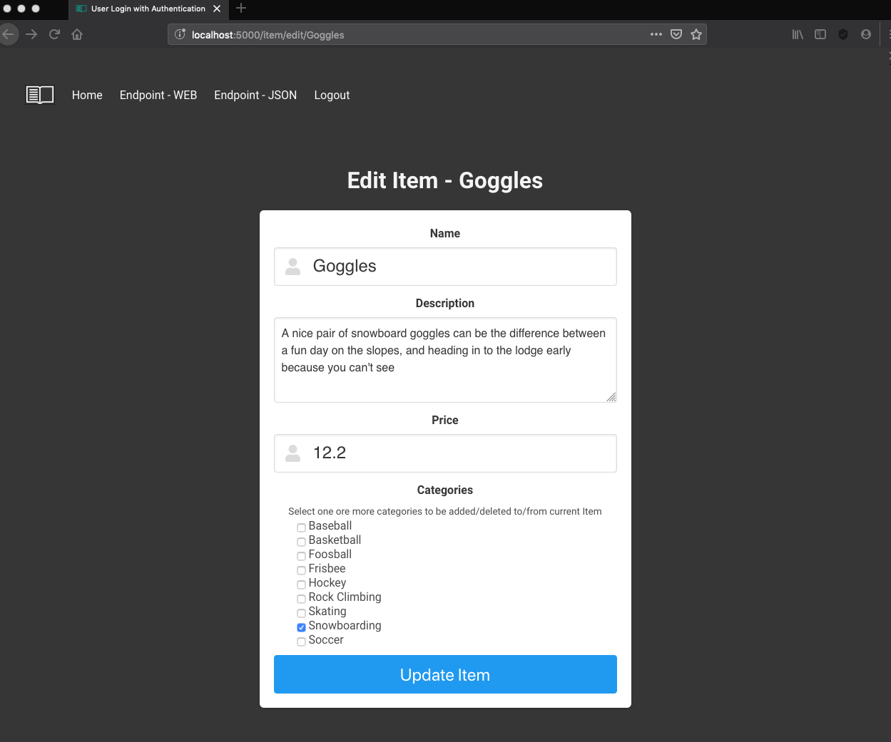

| Path                    | Description                                                                                   |
|:---                     |:---                                                                                           |
| /item/edit/<item_name>/ | Shows the `Item` information and a list of all associated/linked `categories` to be `updated` |

#### Private Routes/Paths - Delete Item   
The logged-in user has the option to `delete` an `Item`, and a validation message appears, if he is the `owner`.   

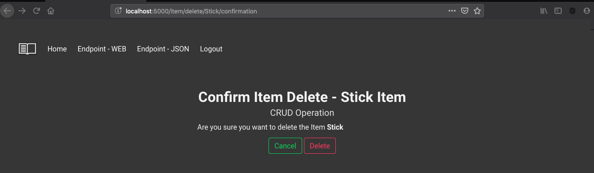

| Path                      | Description                                                           |
|:---                       |:---                                                                   |
| /item/delete/<item_name>/ | Shows a message to validate the `delete` operation on selected `Item` |

#### Private Routes/Paths - EndPoint - HTML   
A logged-in user has the option to see an `endpoint` in `HTML` format.   

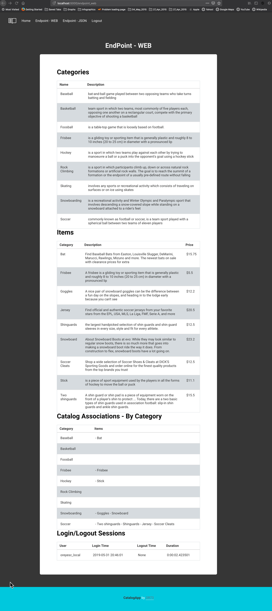
   
| Path          | Description                                                      |
|:---           |:---                                                              |
| /endpoint_web | Shows all application data, stored in DataBase, in `HTML` format |

#### Private Routes/Paths - EndPoint - JSON   
A logged-in user has the option to see an `endpoint` in `JSON` format.   

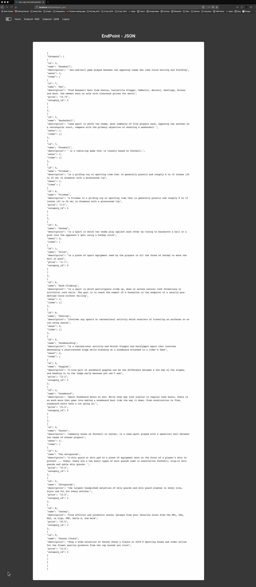
   
| Path           | Description                                                      |
|:---            |:---                                                              |
| /endpoint_json | Shows all application data, stored in DataBase, in `JSON` format |

## Installation
### Git

If you don't already have Git installed, [download Git from git-scm.com.](http://git-scm.com/downloads) Install the version for your operating system.

On Windows, Git will provide you with a Unix-style terminal and shell (Git Bash).  
(On Mac or Linux systems you can use the regular terminal program.)

You will need Git to install the configuration for the VM. If you'd like to learn more about Git, [take a look at our course about Git and Github](http://www.udacity.com/course/ud775).

### VirtualBox

VirtualBox is the software that actually runs the VM. [You can download it from virtualbox.org, here.](https://www.virtualbox.org/wiki/Downloads)  Install the *platform package* for your operating system.  You do not need the extension pack or the SDK. You do not need to launch VirtualBox after installing it.

**Ubuntu 14.04 Note:** If you are running Ubuntu 14.04, install VirtualBox using the Ubuntu Software Center, not the virtualbox.org web site. Due to a [reported bug](http://ubuntuforums.org/showthread.php?t=2227131), installing VirtualBox from the site may uninstall other software you need.

### Vagrant

Vagrant is the software that configures the VM and lets you share files between your host computer and the VM's filesystem.  [You can download it from vagrantup.com.](https://www.vagrantup.com/downloads) Install the version for your operating system.

**Windows Note:** The Installer may ask you to grant network permissions to Vagrant or make a firewall exception. Be sure to allow this.

## Fetch the Source Code and VM Configuration

**Windows:** Use the Git Bash program (installed with Git) to get a Unix-style terminal.  
**Other systems:** Use your favorite terminal program.

From the terminal, run:

    git clone https://github.com/or73/Catalog

This will give you a directory named **Catalog** complete with the source code for the flask application, a vagrantfile, and a bootstrap.sh file for installing all of the necessary tools. 

## Run the virtual machine!

Using the terminal, change directory to `Catalog` (**cd Catalog**), then type **vagrant up** to launch your virtual machine.

## Running the Catalog App
Once it is up and running, type **vagrant ssh**. This will log your terminal into the virtual machine, and you'll get a Linux shell prompt. When you want to log out, type **exit** at the shell prompt.  To turn the virtual machine off (without deleting anything), type **vagrant halt**. If you do this, you'll need to run **vagrant up** again before you can log into it.

Now that you have Vagrant up and running type **vagrant ssh** to log into your VM.  
1. Change to the `/vagrant` directory by typing **cd vagrant**. This will take you to the shared folder between your virtual machine and host machine.
2. Type **ls** to ensure that you are inside the directory that contains `project.py` file, and some directories called `database`, `modules`, `routes`, `static`, and `templates`
3. Type **cd database** to go to `database` directory.
4. Type **python database_setup.py** <press enter> to initialize the database.
5. Type **python database_populate.py** to populate the database with `Categories`, `Items` and `Users`. (Optional)
6. Type **python project.py** to run the Flask web server. 
7. In your browser visit **http://localhost:5000** to view the `Catalog` app.  
8. You should be able to view all `Categories` and last ten (10) `Items`, next to each `Item` you can see the `Categries` to which it belong.
9. In the upper right corner you should see a `Login` button, to login and have access to CRUD (Create, Read, Update, Delete) operations over `Category` and `Item`.

